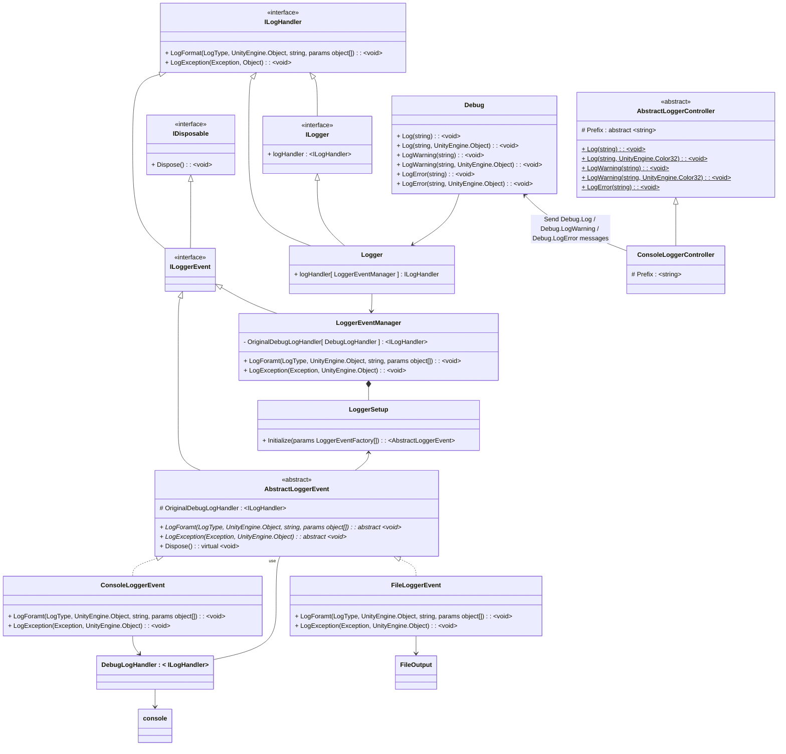
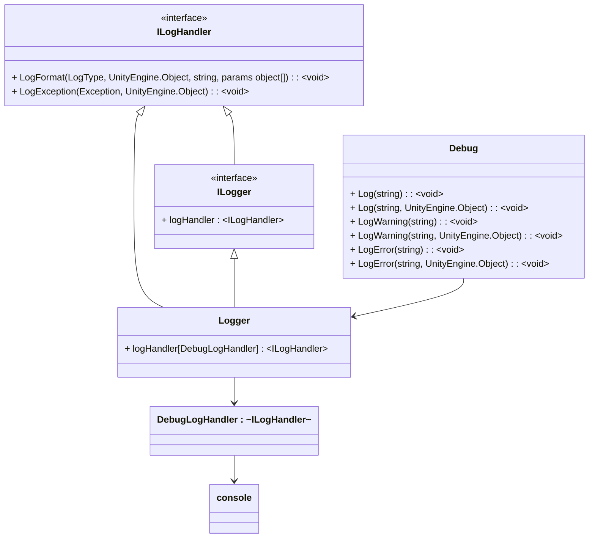

# CustomDebugLogger
     


# Table of Contents
- [Description](#description)
  - [Function structure](#function-structure)
- [Usage](#usage)
  - [Initialize](#initialize)
    - [Example 1](#example-1)
    - [Example 2](#example-2)
  - [Run](#run)
- [Provided Event Functionality](#provided-event-functionality)
  - [Registering Events](#registering-events)
- [Provided Controller Functionality](#provided-controller-functionality)


- [License](#license)
<hr>

# Description

Add custom processing before being displayed in the console using Debug.Log, Debug.LogWarning, Debug.LogError, etc.

### Installation
Install from Unity Package Manager.
- Window -> Package Manager
- "+" -> Add package from git URL...   
```https://github.com/ADONE-Games/CustomDebugLogger.git?path=/Assets/LogSystem```
<hr>

## Function structure



<details>
<summary>The original structure of the Debug.Log series</summary>



</details>
<hr>

# Usage

Create your own class inheriting from ```ADONEGames.CustomDebugLogger.AbstractLoggerEvent```.  
Specify it using ```ADONEGames.CustomDebugLogger.LoggerSetup.Initialize( params LoggerEventFactory[] )```.
<hr>

## Initialize

### Example 1

```csharp
    public class LoggerTest : MonoBehaviour
    {
        private void Start()
        {
            LoggerSetup.Initialize( handler => new ConsoleLoggerEvent( handler ), handler => new FileLoggerEvent( handler ) );
        }
    }
```

### Example 2

```csharp
    public class LoggerTest
    {
        // Auto-start before the splash scene
        [RuntimeInitializeOnLoadMethod( RuntimeInitializeLoadType.BeforeSplashScreen )]
        private static void Initialize()
        {
            LoggerSetup.Initialize( handler => new ConsoleLoggerEvent( handler ), handler => new FileLoggerEvent( handler ) );
        }
    }
```
<hr>

## Run

```csharp
    public class ButtonTrigger : MonoBehaviour
    {
        public void OnClick_NormalDebugLog()
        {
            Debug.Log( "Button Clicked!" );
        }
        public void OnClick_CustomDebugLog()
        {
            MyClassLoggerController.Log( "ボタン　クリック！", Color.magenta );
        }
    }
```

https://github.com/ADONE-Games/CustomDebugLogger/assets/41104542/daf1c788-48b4-418c-aac7-8c42a838545e
<hr>


# Provided Event Functionality

|ADONEGames.CustomDebugLogger||
|-----|-----|
|AbstractLoggerEvent|Abstract class for additional processing|

|ADONEGames.CustomDebugLogger|||
|-----|-----|-----|
|ConsoleLoggerEvent|Console display|Inherit from AbstractLoggerEvent|
|FileLoggerEvent|File output|Inherit from AbstractLoggerEvent|
<hr>

## Registering Events

|ADONEGames.CustomDebugLogger|||
|----------------------------|-----------------------------------------|-|
| LoggerSetup                | -                                       |Initialization Class|
| -                          | Initialize(params LoggerEventFactory[]) |Registration of additional processing|

```csharp
LoggerSetup.Initialize( handler => new ConsoleLoggerEvent( handler ), handler => new FileLoggerEvent( handler ) );
```
<hr>

# Provided Controller Functionality

|ADONEGames.CustomDebugLogger||
|-----|-----|
|AbstractLoggerController|Abstract class for the controller|

|ADONEGames.CustomDebugLogger|||
|-----|-----|-----|
|ConsoleLoggerController|Console display|Inherit from AbstractLoggerController|

```csharp
ConsoleLoggerController.Log( "Hello World!" );
ConsoleLoggerController.Log( "Hello World!", new Color32( 255, 255, 255, 255 ) );
ConsoleLoggerController.LogWarning( "Hello World!" );
ConsoleLoggerController.LogWarning( "Hello World!", new Color32( 255, 255, 255, 255 ) );
ConsoleLoggerController.LogError( "Hello World!" );
```
<hr>


### License

This software is released under the MIT License.  
You are free to use it within the bounds of the license.  
When using it, please include the following copyright and license notices.

[LICENSE](https://github.com/ADONE-Games/CustomDebugLogger/blob/main/LICENSE)
<hr>
