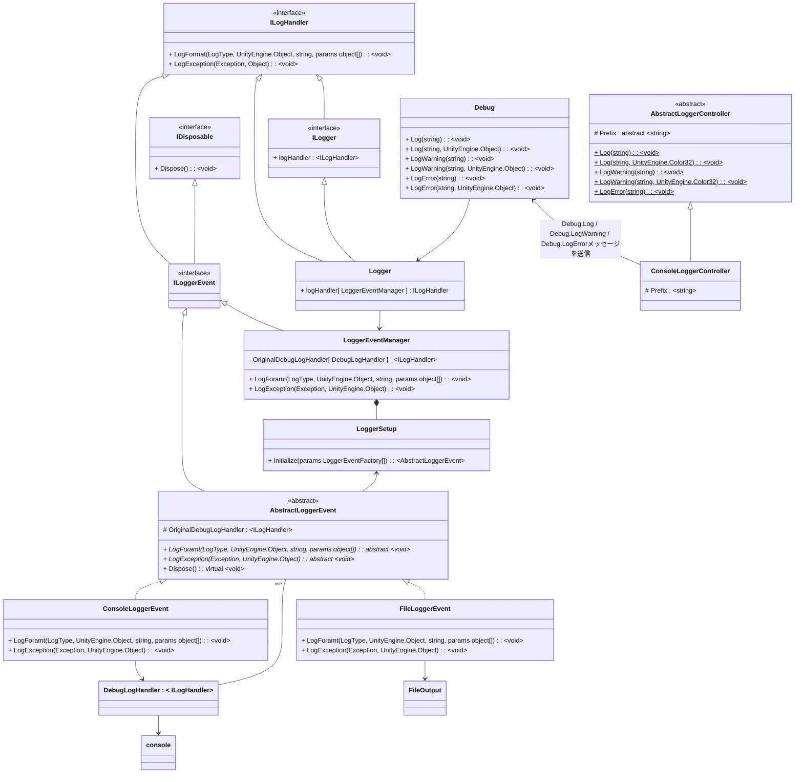
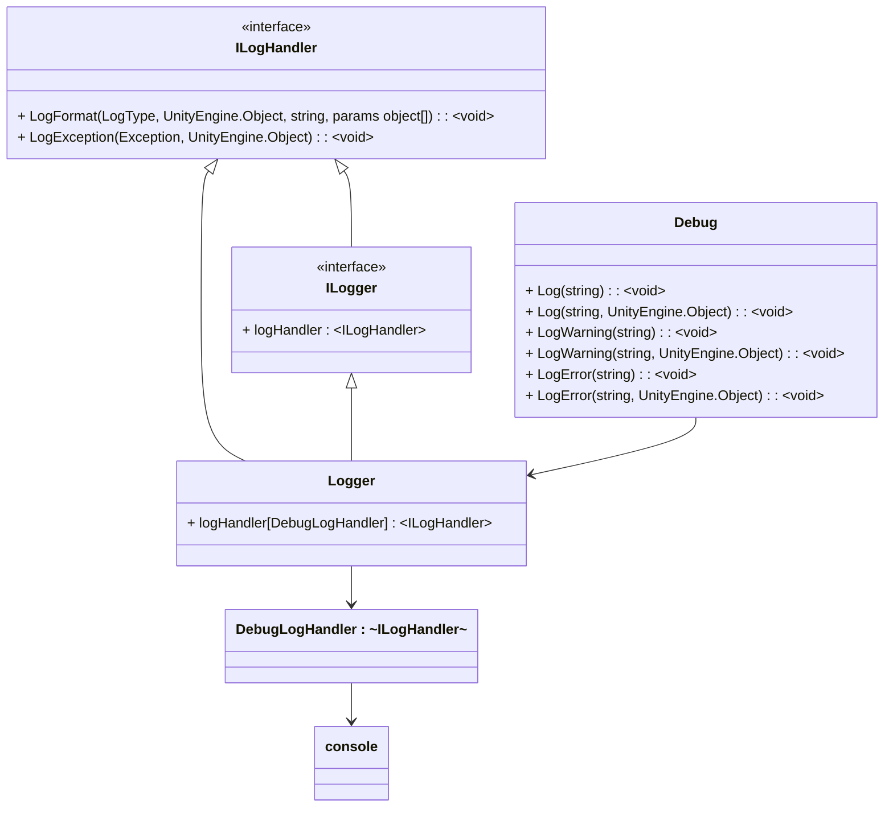

# CustomDebugLogger
   


# 目次
- [説明](#説明)
  - [機能構造](#機能構造)
- [使用方法](#使用方法)
  - [初期化](#初期化)
    - [例1](#例1)
    - [例2](#例2)
  - [実行](#実行)
- [イベント機能](#イベント機能)
  - [イベントの登録](#イベントの登録)
- [コントローラー機能](#コントローラー機能)

- [ライセンス](#ライセンス)
<hr>

# 説明

Debug.Log/Debug.LogWarning/Debug.LogErrorなどでコンソールに表示される前に独自の処理を追加する。
<hr>

## 機能構造



<details>
<summary>元のDebug.Log系の構造</summary>



</details>
<hr>

# 使用方法

```ADONEGames.CustomDebugLogger.AbstractLoggerEvent```を継承した自身のクラス作成  
```ADONEGames.CustomDebugLogger.LoggerSetup.Initialize( params LoggerEventFactory[] )```で指定する。
<hr>

## 初期化

### 例1

```csharp
    public class LoggerTest : MonoBehaviour
    {
        private void Start()
        {
            LoggerSetup.Initialize( handler => new ConsoleLoggerEvent( handler ), handler => new FileLoggerEvent( handler ) );
        }
    }
```

### 例2

```csharp
    public class LoggerTest
    {
        // スプラッシュシーン前に自動起動
        [RuntimeInitializeOnLoadMethod( RuntimeInitializeLoadType.BeforeSplashScreen )]
        private static void Initialize()
        {
            LoggerSetup.Initialize( handler => new ConsoleLoggerEvent( handler ), handler => new FileLoggerEvent( handler ) );
        }
    }
```
<hr>

## 実行

```csharp
    public class ButtonTrigger : MonoBehaviour
    {
        public void OnClick_NormalDebugLog()
        {
            Debug.Log( "Button Clicked!" );
        }
        public void OnClick_CustomDebugLog()
        {
            MyClassLoggerController.Log( "ボタン　クリック！", Color.magenta );
        }
    }
```

https://github.com/ADONE-Games/CustomDebugLogger/assets/41104542/daf1c788-48b4-418c-aac7-8c42a838545e
<hr>


# イベント機能

|ADONEGames.CustomDebugLogger||
|-----|-----|
|AbstractLoggerEvent|追加処理の抽象クラス|

|ADONEGames.CustomDebugLogger|||
|-----|-----|-----|
|ConsoleLoggerEvent|コンソール表示|AbstractLoggerEventを継承|
|FileLoggerEvent|ファイル書き出し|AbstractLoggerEventを継承|
<hr>

## イベントの登録

|ADONEGames.CustomDebugLogger|||
|----------------------------|-----------------------------------------|-|
| LoggerSetup                | -                                       |初期化クラス|
| -                          | Initialize(params LoggerEventFactory[]) |追加処理の登録|

```csharp
LoggerSetup.Initialize( handler => new ConsoleLoggerEvent( handler ), handler => new FileLoggerEvent( handler ) );
```
<hr>

# コントローラー機能

|ADONEGames.CustomDebugLogger||
|-----|-----|
|AbstractLoggerController|コントローラーの抽象クラス|

|ADONEGames.CustomDebugLogger|||
|-----|-----|-----|
|ConsoleLoggerController|コンソール表示|AbstractLoggerControllerを継承|

```csharp
ConsoleLoggerController.Log( "Hello World!" );
ConsoleLoggerController.Log( "Hello World!", new Color32( 255, 255, 255, 255 ) );
ConsoleLoggerController.LogWarning( "Hello World!" );
ConsoleLoggerController.LogWarning( "Hello World!", new Color32( 255, 255, 255, 255 ) );
ConsoleLoggerController.LogError( "Hello World!" );
```
<hr>


### ライセンス

本ソフトウェアはMITライセンスで公開しています。  
ライセンスの範囲内で自由に使用可能です。  
使用する際は、以下の著作権表示とライセンス表示をお願いします。  

[LICENSE](https://github.com/ADONE-Games/CustomDebugLogger/blob/main/LICENSE)
<hr>
